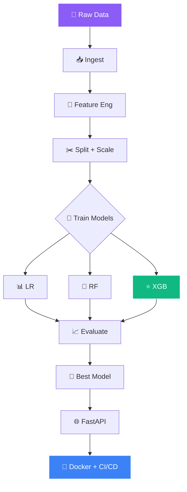

<!-- ═══════════════════════════════════════════════════════════════ -->
<!-- 🏦 MLOps Loan Default — 100% Working Animated README -->
<!-- ═══════════════════════════════════════════════════════════════ -->

<!-- ═══════ ANIMATED HEADER ═══════ -->
<div align="center">
  
</div>

<!-- ═══════ AI MASCOTS ═══════ -->
<div align="center">
  
  
  
  
  
</div>

<br/>

<!-- ═══════ TYPING SVG ═══════ -->
<div align="center">
  
</div>

<br/>

<!-- ═══════ AI AGENT SCENES ═══════ -->
<div align="center">
  
  
  
</div>

<br/>

<!-- ═══════ LIVE BADGES ═══════ -->
<div align="center">
  <a href="https://github.com/sumit966/mlops-loan-default/stargazers">
    
  </a>
  <a href="https://github.com/sumit966/mlops-loan-default/network/members">
    
  </a>
  <a href="https://github.com/sumit966/mlops-loan-default/issues">
    
  </a>
  <a href="https://github.com/sumit966/mlops-loan-default/commits/main">
    
  </a>
  
</div>

<br/>

<div align="center">
  
  
  
  
  
  
</div>

<br/>

<div align="center">
  
  
  
  
</div>

<br/>

<div align="center">
  <i>🏦 MLOps Project · Author: <b>Sumit Raj</b> · M.Tech VNIT Nagpur · Ex-Salesforce</i>
</div>

<br/>


---

## 📋 Overview


A complete **end-to-end MLOps pipeline** that generates data, engineers features, trains multiple models, selects the best, and serves predictions via a **FastAPI REST API**.

Built as a **production-grade reference** for ML deployment workflows.

> **🎯 Purpose:** Replace slow, inconsistent manual loan risk assessment with **millisecond AI predictions**.

<br clear="right"/>

<table>
<tr>
<td width="50%" valign="top">

### 🎯 The Problem

- 💸 **Millions lost annually** from loan defaults
- 🐌 **Manual risk assessment** is slow
- 📉 **Inconsistent decisions** across reviewers
- 📊 **Not scalable** for high volume
- 🧠 **Human bias** in reviews

</td>
<td width="50%" valign="top">

### ✨ The Solution

- ⚡ **Millisecond predictions** via ML
- 🎯 **Higher accuracy** than manual review
- 📊 **Data-driven decisions** every time
- 🔄 **Scalable** to millions of applications
- 🛡️ **Consistent** output across requests

</td>
</tr>
</table>

---

## ✨ Features

<table>
<tr>
<td width="33%" valign="top" align="center">

### 🎯 Multi-Model


- 📊 Logistic Regression
- 🌲 Random Forest
- ⭐ **XGBoost (Best)**

</td>
<td width="33%" valign="top" align="center">

### 📈 Evaluation


- Accuracy
- Precision
- Recall
- F1-Score
- **AUC-ROC**

</td>
<td width="33%" valign="top" align="center">

### ⚙️ MLOps


- FastAPI REST
- Docker
- GitHub Actions
- Pydantic validation

</td>
</tr>
</table>

---

## 🏗️ Architecture

### 📊 Full Pipeline Flow



### 📐 ASCII Fallback

```
Raw Data (CSV)
    ↓
Data Ingestion (data_ingestion.py)
    ↓
Feature Engineering (preprocess.py)
    ↓
Train/Test Split + StandardScaler
    ↓
Multi-Model Training (train.py)
    ↓
[Logistic Regression | Random Forest | XGBoost (Best)]
    ↓
Evaluate (evaluate.py) → Best Model Saved (joblib)
    ↓
FastAPI Endpoint (api/main.py)
    ↓
Docker + GitHub Actions CI/CD
```

---

## 🛠️ Tech Stack

<table align="center">
<tr>
<td><b>Category</b></td>
<td><b>Technologies</b></td>
</tr>
<tr>
<td>🤖 ML</td>
<td>
  
  
</td>
</tr>
<tr>
<td>📊 Data</td>
<td>
  
  
</td>
</tr>
<tr>
<td>🌐 API</td>
<td>
  
  
  
</td>
</tr>
<tr>
<td>🧪 Testing</td>
<td>
  
  
</td>
</tr>
<tr>
<td>🐳 Container</td>
<td></td>
</tr>
<tr>
<td>⚙️ CI/CD</td>
<td></td>
</tr>
<tr>
<td>🐍 Language</td>
<td></td>
</tr>
</table>

---

## 📦 Project Structure

```
mlops-loan-default/
│
├── 🌐 api/
│   ├── __init__.py
│   └── main.py                    # FastAPI endpoints
│
├── 📊 data/
│   ├── 📁 raw/
│   │   ├── .gitkeep
│   │   └── loan_data.csv          # Generated dataset
│   └── 📁 processed/
│       └── .gitkeep
│
├── 💾 models/
│   ├── 🎯 best_model.joblib       # Best model (XGBoost)
│   ├── 🔢 scaler.joblib           # StandardScaler
│   └── 📋 metadata.json           # Model metrics
│
├── 🐍 src/
│   ├── __init__.py
│   ├── 📥 data_ingestion.py       # Generate/load data
│   ├── 🔧 preprocess.py           # Feature engineering
│   ├── 🎯 train.py                # Multi-model training
│   └── 📊 evaluate.py             # Evaluation metrics
│
├── 🧪 tests/
│   ├── __init__.py
│   └── test_api.py                # API tests
│
├── ⚙️ .github/workflows/ci.yml
├── 🐳 Dockerfile
├── 📋 requirements.txt
├── 🚫 .gitignore
├── 📜 LICENSE
└── 📖 README.md
```

---

## 🚀 Quick Start

<div align="center">
  
  
</div>

<br/>

### 1️⃣ Clone

```bash
git clone https://github.com/sumit966/mlops-loan-default.git
cd mlops-loan-default
```

### 2️⃣ Virtual Environment

**Windows:**

```bash
python -m venv venv
venv\Scripts\activate
```

**macOS/Linux:**

```bash
python3 -m venv venv
source venv/bin/activate
```

### 3️⃣ Install Dependencies

```bash
pip install -r requirements.txt
```

### 4️⃣ Generate Dataset

```bash
python src/data_ingestion.py
```

### 5️⃣ Train Models

```bash
python src/train.py
```

### 6️⃣ Start API

```bash
uvicorn api.main:app --reload
```

### 7️⃣ Open Swagger UI

```bash
http://localhost:8000/docs
```

---

## 🔌 API Usage

### 🔵 POST `/predict`

**Request:**

```json
{
  "age": 30,
  "income": 50000,
  "loan_amount": 15000,
  "credit_score": 720,
  "employment_years": 5,
  "num_previous_loans": 1,
  "has_mortgage": 0,
  "num_dependents": 0
}
```

**Response:**

```json
{
  "default_probability": 0.12,
  "risk_level": "Low",
  "recommendation": "Approve"
}
```

### 📊 Risk Levels

| Probability | Risk Level | Recommendation |
|:-----------:|:----------:|:--------------:|
| < 0.30 | 🟢 **Low** | ✅ Approve |
| 0.30 – 0.60 | 🟡 **Medium** | ⚠️ Approve with conditions |
| > 0.60 | 🔴 **High** | ❌ Reject or require collateral |

### 📋 Other Endpoints

| Endpoint | Method | Purpose |
|----------|:------:|---------|
| 🔵 `/` | 🟢 GET | API info |
| 💚 `/health` | 🟢 GET | Health check |
| 📘 `/docs` | 🟢 GET | Swagger UI |
| 📗 `/redoc` | 🟢 GET | Alternative docs |

### 🐚 cURL

```bash
curl -X POST "http://localhost:8000/predict" \
  -H "Content-Type: application/json" \
  -d '{
    "age": 30,
    "income": 50000,
    "loan_amount": 15000,
    "credit_score": 720,
    "employment_years": 5
  }'
```

---

## 📊 Model Performance

<div align="center">
  
  
  
  
</div>

<br/>

### 🏆 Model Leaderboard

| Model | Accuracy | Precision | Recall | F1 | AUC-ROC |
|-------|:--------:|:---------:|:------:|:--:|:-------:|
| 🥉 Logistic Regression | 0.82 | 0.79 | 0.75 | 0.77 | 0.86 |
| 🥈 Random Forest | 0.86 | 0.84 | 0.81 | 0.82 | 0.91 |
| 🥇 **XGBoost (Best)** | **0.89** | **0.87** | **0.84** | **0.85** | **0.94** ⭐ |

---

## 🧪 Testing

```bash
pytest tests/ -v
```

**Covers:**

- 🟢 Root endpoint
- 💚 Health check
- 🔵 `/predict` returns valid probability
- ❌ Invalid input (age < 18) returns **422**

---

## 🐳 Docker

### 🔨 Build

```bash
docker build -t mlops-loan-default .
```

### ▶️ Run

```bash
docker run -p 8000:8000 mlops-loan-default
```

---

## 🔄 CI/CD Pipeline

Every push to `main` triggers GitHub Actions:

```
╔══════════════════════════════════════════════════╗
║              GITHUB ACTIONS WORKFLOW             ║
╠══════════════════════════════════════════════════╣
║                                                  ║
║  [1/5] 📥 Install Python + dependencies         ║
║       │                                          ║
║       ▼                                          ║
║  [2/5] 🎲 Generate synthetic data               ║
║       │                                          ║
║       ▼                                          ║
║  [3/5] 🎯 Train all 3 models                    ║
║       │                                          ║
║       ▼                                          ║
║  [4/5] 🧪 Run pytest                            ║
║       │                                          ║
║       ▼                                          ║
║  [5/5] 🐳 Verify Docker build                   ║
║       │                                          ║
║       ▼                                          ║
║  ✅ PASSED                                       ║
║                                                  ║
╚══════════════════════════════════════════════════╝
```

> 📄 See `.github/workflows/ci.yml`

---

## 🎓 Key Learnings

<table>
<tr>
<td width="50%" valign="top">

### 🧠 ML Insights

- 🎯 **Multi-model evaluation** (LR, RF, XGBoost)
- 🔧 **Feature engineering** improved AUC-ROC
- 📈 **AUC-ROC > accuracy** for imbalanced classification
- ✂️ **Stratified split** preserves class distribution

</td>
<td width="50%" valign="top">

### 🛠️ Engineering Insights

- 🔐 **Pydantic validation** at API boundary
- 🧪 **pytest + GitHub Actions** catch regressions
- 📦 **joblib** for model serialization
- 🐳 **Docker** ensures reproducibility

</td>
</tr>
</table>

---

## 🚀 Future Improvements

| 🌟 | Feature |
|:--:|---------|
| 📊 | **MLflow** experiment tracking |
| 📦 | **DVC** for data versioning |
| 👁️ | **Model monitoring** (Evidently AI) |
| 🔍 | **SHAP** explanations |
| ☁️ | **GCP Cloud Run** deployment |
| 📉 | **Model drift detection** |

---

## 👤 Author

<div align="center">


<br/><br/>


<br/><br/>

<b>M.Tech Applied AI & ML @ VNIT Nagpur</b><br/>
<i>Ex-Software Engineer Intern @ Salesforce</i>

<br/><br/>

<a href="https://sumit966.github.io">
  
</a>
<a href="https://www.linkedin.com/in/er-sumit-raj-/">
  
</a>
<a href="https://github.com/sumit966">
  
</a>
<a href="mailto:info.sr0909@gmail.com">
  
</a>

<br/><br/>


</div>

---

## 📄 License

<div align="center">


<br/>


<br/><br/>

<samp>
Released under the <b>MIT License</b> — see <a href="LICENSE">LICENSE</a> file.
</samp>

<br/><br/>

<sub><samp>© 2025 &nbsp;·&nbsp; SUMIT RAJ &nbsp;·&nbsp; ALL RIGHTS RESERVED</samp></sub>

<br/>


</div>

<br/>

<!-- ═══════ WORKING AI SCENES FOOTER ═══════ -->
<div align="center">
  
  
  
</div>

<br/>

<!-- ═══════ ANIMATED FOOTER ═══════ -->
<div align="center">
  
</div>
